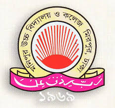

Monipur High School (Branch-1) {align="center"}
------------------------------

* * * * *

* * * * *

Monipur High School & College is a secondary school and college located
in Mirpur, Dhaka, Bangladesh. The school is also known as Monipur Uccha
Viddalaya Ebong College (MUBC). In 2007, 2008 and 2009, the school
ranked 3rd and in 2010 and 2011 the school ranked 6th and 7th & 8th in
2012 Secondary School Certificate examination under the Dhaka Education
Board. And in 2012, 2013 and 2014 this school ranked first in the PEC
Examination.[1] Monipur High School stood first on 2011, 2012 & 2013 on
the PSC exam.

The school secured the 2nd position in [2] in terms of securing highest
number of first divisions in the primary terminal examinations across
the country. A total of 1,516 students achieved first division from
Viqarunnisa Noon School and College while 1,126 from Monipur High School
& College and 962 from Ideal School and College.

652 students scored A+ (or GPA 5.0) in 2008 and 556 students achieved
the same in 2009, placing the school in the top three in Bangladesh's
GPA 5 based schools ranking.

Following demands to enroll more students, the school authorities opened
two more branches in Dhaka city, while the main campus at Monipur
continues to operate with its decade old tradition since 1969.

* * * * *

Friends of MUBC

Name

Section

Roll

Nur

B

67

Sazid

B

77

Mehrab

A

57

* * * * *

Md.Nur E Alam Siddiquee Sazid Bin Saif Mehrab Hasan Ifterkhar Tanjim
User name: \
 Password: \
\
 Email: \
\
 Religion:Islam Hindu \
\
 Gender:Male Female\
\
 Group: Science Commerce \
\
 Comment:\

\
\

* * * * *

\

1.  [MUBC facebook page](https://www.facebook.com/mhsc.edu/)
2.  [Visit my website](https://md-nur.github.io/Porfolio/)
3.  [Got to top]()

\
\
 developed by ©Md.Nur E Alam Siddiquee
